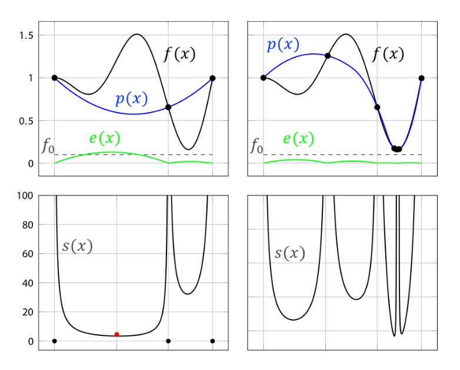

# DOGS-python

A derivative-free global optimization algorithm based on Delaunay triangulation designed to solve efficiently the problems whose function evaluations process is nonconvex and computationally expensive. This package particularly well-suited when the objective function is like a black-box function.

## Getting Started

These instructions will get you a copy of the project up and running on your local machine for development and testing purposes. See deployment for notes on how to deploy the project on a live system.

### Prerequisites
You need to downlaod and install anaconda python 3 package:

```
https://www.anaconda.com/download/#macos
```

## Installation
Clone the package into your workspace:

```
git clone https://github.com/deltadogs/DOGS-python/
```

And then 

```
cd DOGS-python
```
## The essential elements of DeltaDOGS
The essential elements of  DeltaDOGS, in different iterations for a 1D example. Top subfigures indicate (black) the truth function f(x), (blue) the interpolating surrogate function p(x), (green) the synthetic model of the uncertainty e(x), (dashed) the target value f0 = 0.07, and (black circles) previous datapoints. Bottom subfigures indicate the search function s(x), as defined in (2), and (red circles) the minimizer of s(x), the next datapoint to evaluate.


## Running the tests

Here is an example on Schewfel function. 

### Test demo


```
python DeltaDOGS_AdaptiveK.py
```


## Release History


* 0.1.0
    * The first proper release
    * ADD: add constant K method 
* 0.0.1
    * Work in progress


## Authors

* **Shahrouz Ryan Alimo** - *Initial work and correponding author* - [github](https://github.com/salimoha) [webpage](https://acsweb.ucsd.edu/~salimoha/)
* **Muhan Zhao** - *Contributor* -  
See also the list of [contributors](https://github.com/your/project/contributors) who participated in this project.

## License

This project is licensed under the MIT License - see the [License.md](License.md) file for details

## Acknowledgments

[UCSD flow control and robotics labs](https://www.ucsdrobotics.org/derivative-free-optimization) 


